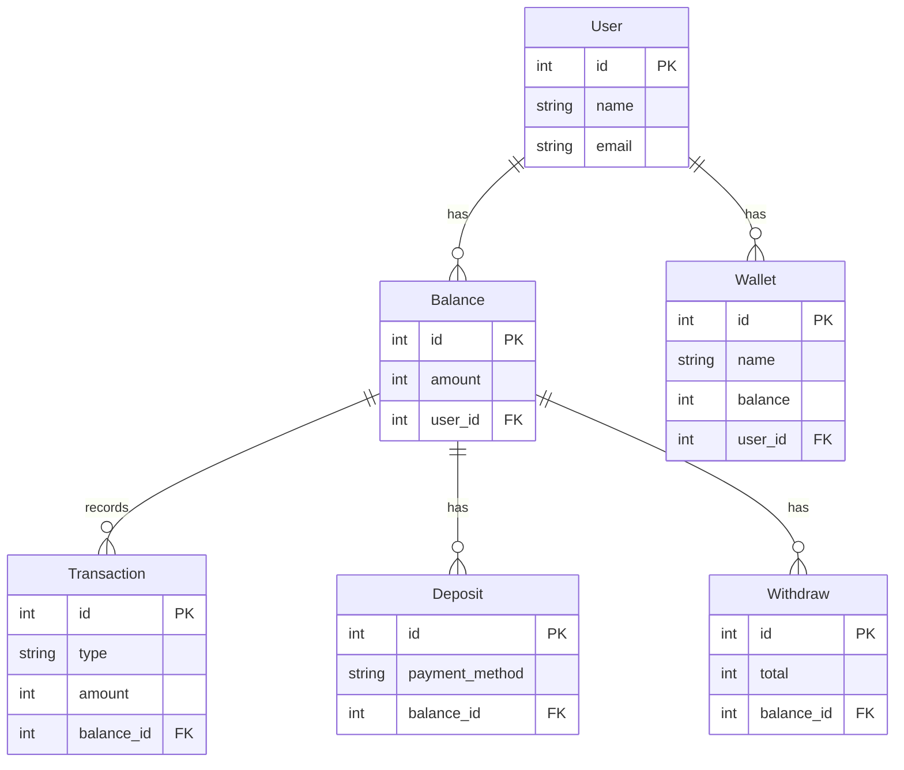

# ERD Mermaid Sistem E-wallet

```mermaid
erDiagram
User {
    int id PK
    string name
    string email
}

Withdraw {
    int id PK
    int total
    int balance_id FK
}

Balance {
    int id PK
    int amount
    int user_id FK
}

Transaction {
    int id PK
    string type
    int amount
    int balance_id FK
}

Deposit {
    int id PK
    string payment_method
    int balance_id FK
}

Wallet {
    int id PK
    string name
    int balance
    int user_id FK
}

User ||--o{ Wallet : has
User ||--o{ Balance : has
Balance ||--o{ Transaction : records
Balance ||--o{ Deposit : has
Balance ||--o{ Withdraw : has
```