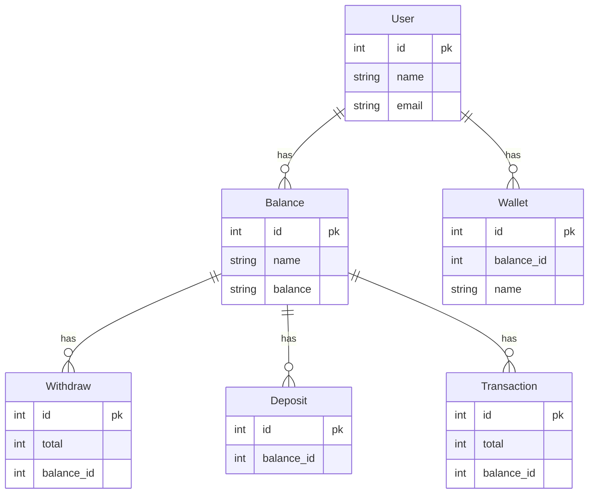

```mermaid
erDiagram
User {
    int id pk
    string name
    string email
}

Withdraw {
    int id pk
    int total
    int balance_id
}

Balance {
    int id pk
    string name
    string balance
}

Transaction {
    int id pk
    int total
    int balance_id
}

Deposit {
    int id pk
    int balance_id
}

Wallet {
    int id pk
    int balance_id
    string name
}

User ||--O{ Balance : has 
User ||--O{ Wallet : has 
Balance ||--o{ Withdraw : has
Balance ||--o{ Deposit : has
Balance ||--o{ Transaction : has
```